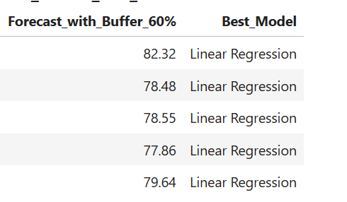
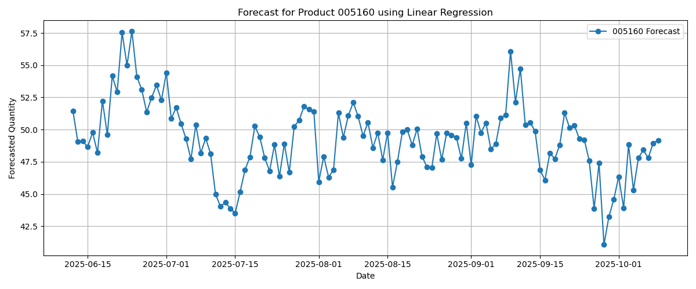

# 🔮 Time Series Forecasting: 4 Types of Water (Next 60 Days)
## IN THE PREPROCESSING REMOVE OUTLIRE AND NULL VALUES.
## AFTER THAT THE TIME COLUMN MAKES AS INDEX 

This project performs time series forecasting for **four different types of water** using a single dataset. It predicts future demand for the next **60 days** using historical daily data.
## forecast using below all the models.
---


---
## sameple of the best model forecasting 


## according to the we find the best model for each 


## finally need to save with supply chani special requrement bout buffer and need to keeping special order requirments 


-----

# final forecasted images




## 📁 Data

The project uses one CSV file: `60.csv`

### 🔢 Data Format

The CSV must contain:

| date       | 1       | 2        | 3    | 4       |
|------------|---------|----------|------|---------|
| 2024-01-01 | 120     | 95       | 240  | 88      |
| 2024-01-02 | 130     | 100      | 235  | 90      |
| ...        | ...     | ...      | ...  | ...     |

- **date**: Date of record (YYYY-MM-DD)
- **1**, **2**, **3**, **4**: daily values for each water type

> ⚠️ Make sure the file has no missing dates or null values.

---

## 📦 Requirements

Install dependencies using:

```bash
pip install -r requirements.txt
